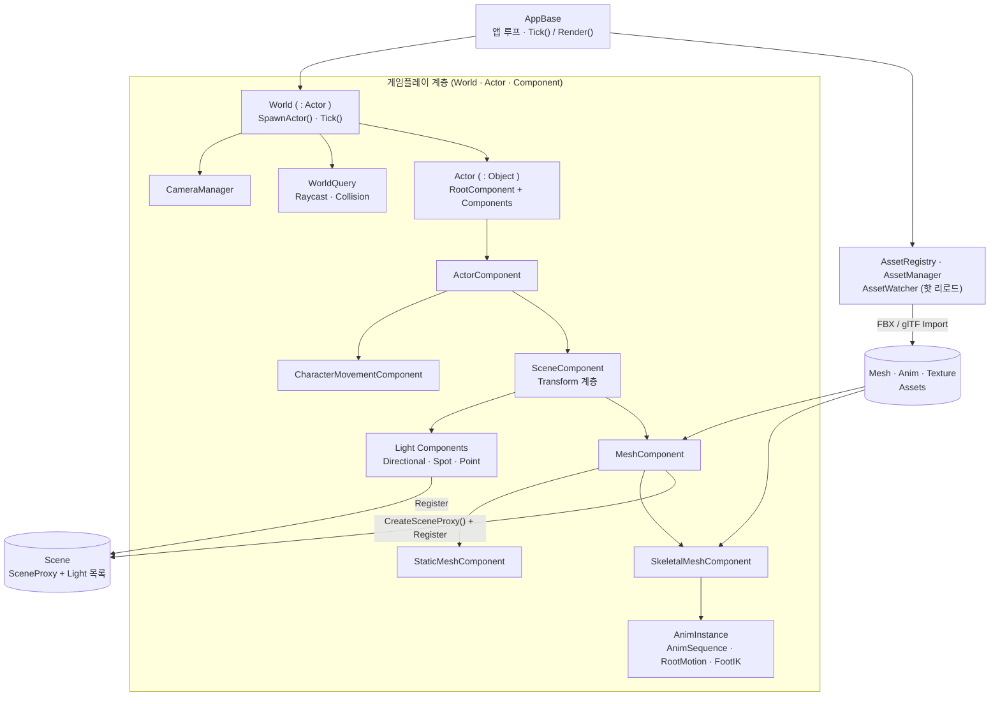
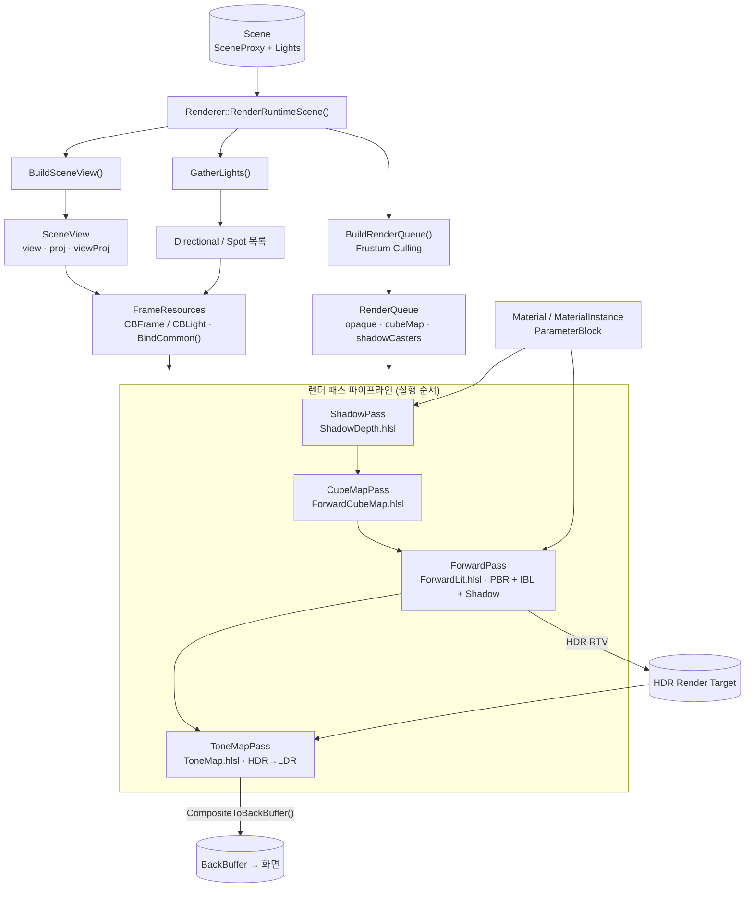

# JMEngine

> DirectX 11 기반으로 직접 구현한 C++ 게임 엔진 — PBR 렌더러 · 스켈레탈 애니메이션 · 에셋 파이프라인 · ImGui 에디터
> A from-scratch C++ game engine on Direct3D 11.

**PBR Render**


**Animation**


---

## 개요

JMEngine은 상용 엔진 없이 **Direct3D 11과 C++17만으로 직접 설계·구현한 실시간 렌더링 엔진**입니다.
언리얼 엔진의 구조(SceneProxy → RenderQueue → 다중 렌더 패스, Actor–Component 모델)를 참고하여,
렌더링·애니메이션·에셋 관리·에디터를 하나의 파이프라인으로 통합했습니다.

물리 기반 렌더링(PBR), 이미지 기반 조명(IBL), 그림자, 스켈레탈 애니메이션, FBX/glTF 임포트,
핫 리로드를 지원하는 에셋 레지스트리, ImGui 기반 에디터까지 엔진의 핵심 시스템을 직접 구현하는 데 초점을 맞췄습니다.

---

## 주요 기능

### 렌더링 (Rendering)
- **다중 패스 포워드 렌더러**: Shadow → CubeMap → Forward(PBR) → ToneMap 순으로 구성된 패스 파이프라인
- **물리 기반 렌더링 (PBR)**: Cook-Torrance BRDF, Metallic-Roughness 워크플로
- **이미지 기반 조명 (IBL)**: 큐브맵 기반 디퓨즈/스페큘러 환경광
- **HDR 파이프라인 + 톤매핑**: HDR 렌더 타깃에 누적 후 LDR로 변환
- **그림자 매핑**: PCF 필터링을 적용한 Directional Light 섀도우맵
- **라이트 타입**: Directional / Spot / Point Light
- **프러스텀 컬링**: 뷰 프러스텀과 바운딩 볼륨 교차 판정으로 드로우 컬링
- **머티리얼 시스템**: Material / MaterialInstance / ParameterBlock 분리 구조

### 애니메이션 (Animation)
- **스켈레탈 메시 스키닝**: GPU 본 팔레트 스키닝 (StructuredBuffer)
- **AnimInstance / AnimSequence**: 본 포즈 샘플링 및 애니메이션 재생
- **루트 모션 (Root Motion)**
- **풋 IK (Foot IK)**: 지형에 맞춘 발 위치 보정

### 에셋 시스템 (Asset Pipeline)
- **AssetRegistry**: 가상 경로(Virtual Path) 기반 에셋 관리, 의존성 추적, 누락 파일 GC, JSON 직렬화/역직렬화
- **프로바이더 패턴**: `IAssetRegistryProvider`로 에셋 타입별 빌드 로직 확장
- **AssetWatcher**: 파일 변경 감지 기반 핫 리로드
- **임포터**: FBX(스태틱/스켈레탈/애니메이션), glTF 메시 임포트
- **썸네일 캐시**: 콘텐츠 브라우저용 비동기 썸네일 생성

### 에디터 (Editor)
- **ImGui 기반 에디터**: 도킹 레이아웃, 뷰포트, 디테일 패널
- **콘텐츠 브라우저**: 에셋 탐색 및 썸네일 표시
- **컴포넌트 리플렉션**: 컴포넌트 프로퍼티를 자동으로 디테일 패널에 노출/편집

### 씬 · 게임 프레임워크 (Scene & Gameplay)
- **Actor–Component 모델**: `Actor` + `SceneComponent` / `MeshComponent` / `Light*Component` 등
- **레벨 직렬화**: `LevelAsset` 저장/로드 (LevelSaver / LevelLoader)
- **캐릭터 무브먼트 · 충돌 처리**
- **헤드리스 CLI 테스트 하니스**: 윈도우 없이 루트모션 로직 검증 (`RootMotionHeadlessCli`)

---

## 아키텍처

게임플레이(World–Actor–Component)와 렌더러(Pass 파이프라인)는 **`Scene`을 경계로 분리**됩니다.
게임플레이가 매 프레임 `Scene`에 SceneProxy와 라이트를 등록하면, 렌더러는 `Scene`만 입력으로 받아 렌더링합니다.

### 게임플레이 (Gameplay)

`AppBase`가 `World`를 구동하고, `World`는 `Actor`–`Component` 트리를 소유합니다.
컴포넌트는 `MeshComponent`를 통해 `SceneProxy`를 만들어 `Scene`에 등록하고, 라이트 컴포넌트도 `Scene`에 등록됩니다.



### 렌더러 (Renderer)

`Renderer`는 `Scene`을 받아 컬링·정렬된 `RenderQueue`를 만들고, 패스를 순서대로 실행해 HDR 타깃에 누적한 뒤 톤매핑으로 백버퍼에 출력합니다.



### 모듈 구성

| 모듈 | 역할 |
|------|------|
| `Core` | 앱 진입점, 에셋 레지스트리/매니저, 설정, 유틸 |
| `Graphics` | D3D11 컨텍스트, 셰이더, 머티리얼, 텍스처, FBX/glTF 임포터 |
| `Renderer` | 렌더 패스, 컬링, SceneProxy, RenderQueue, FrameResources |
| `Scene` | 씬/카메라/레벨, 뷰포트 |
| `Game` | Actor–Component, 애니메이션, 캐릭터, 충돌 |
| `UI` | ImGui 핸들러, 콘텐츠 브라우저, 썸네일 캐시 |
| `Editor` | 에디터 컨텍스트, 컴포넌트 리플렉션 |
| `Input` | 입력 처리 |
| `Test` | 헤드리스 CLI 테스트 |

---

## 기술 스택

- **언어**: C++17
- **그래픽스 API**: Direct3D 11 (HLSL Shader Model 5.0)
- **플랫폼**: Windows (x64), Visual Studio 2022 (v143 toolset, Windows 10 SDK)
- **외부 라이브러리**:
  - [Dear ImGui](https://github.com/ocornut/imgui) — 에디터 UI (Win32 + DX11 백엔드)
  - [DirectXTK](https://github.com/microsoft/DirectXTK) — 텍스처 로딩, 헬퍼
  - [DirectXTex](https://github.com/microsoft/DirectXTex) — 텍스처/HDR(.exr) 처리
  - [OpenEXR / Imath](https://github.com/AcademySoftwareFoundation/openexr) — HDR 환경맵
  - [Autodesk FBX SDK](https://aps.autodesk.com/developer/overview/fbx-sdk) — FBX 임포트

> **직접 구현 / 외부 라이브러리 구분**
> 위 라이브러리는 텍스처 로딩 · UI 렌더 · 파일 포맷 파싱 등 보조 용도로만 사용했으며,
> **렌더 파이프라인 · 패스 구조 · 머티리얼 · 애니메이션 · 에셋 레지스트리 · 씬/게임 프레임워크는 전부 직접 구현**했습니다.

---

## 빌드 방법

### 요구 사항
- Windows 10/11 (x64)
- Visual Studio 2022 (Desktop development with C++, Windows 10 SDK)
- [vcpkg](https://github.com/microsoft/vcpkg)
- [Autodesk FBX SDK 2020.x](https://aps.autodesk.com/developer/overview/fbx-sdk) (별도 설치)

### 의존성 설치 (vcpkg)

```powershell
# vcpkg 설치 후
vcpkg install imgui[dx11-binding,win32-binding] directxtk directxtex[openexr] imath
vcpkg integrate install   # VS에 전역 통합 → 프로젝트별 include/lib 경로 설정 불필요
```

FBX SDK는 Autodesk에서 받아 설치한 뒤, Visual Studio 프로젝트 속성에서
include/library 경로를 추가하세요. (예: `C:\Program Files\Autodesk\FBX\FBX SDK\2020.x\`)

### 빌드 & 실행

```powershell
# 1. 솔루션 열기
start JMEngine.sln

# 2. 구성: Release | x64 선택 후 빌드 (Ctrl+Shift+B)

# 3. 실행 — 작업 디렉터리에 Shader/, Contents/ 가 있어야 합니다
```

> 셰이더(`Shader/`)와 샘플 에셋(`Contents/`)은 런타임에 실행 파일의 작업 디렉터리 기준으로 로드됩니다.

---

## 프로젝트 구조

```
JMEngine/
├── Source/
│   └── Modules/
│       ├── Core/        엔진 코어 · 에셋 레지스트리/매니저 · 설정
│       ├── Graphics/    D3D11 컨텍스트 · 셰이더 · 머티리얼 · 임포터
│       ├── Renderer/    렌더 패스 · 컬링 · SceneProxy · RenderQueue
│       ├── Scene/        씬 · 카메라 · 레벨 직렬화
│       ├── Game/         Actor-Component · 애니메이션 · 캐릭터
│       ├── UI/           ImGui 에디터 · 콘텐츠 브라우저
│       ├── Editor/       에디터 컨텍스트 · 리플렉션
│       ├── Input/        입력
│       └── Test/         헤드리스 CLI 테스트
├── Shader/              HLSL 셰이더 (PBR, 섀도우, IBL, 톤매핑 등)
├── Contents/            샘플 에셋 (메시 · 애니메이션 · 텍스처)
└── JMEngine.sln
```

---

## 샘플 콘텐츠

- `DamagedHelmet` (glTF) — PBR / IBL 검증용 표준 에셋
- `Capoeira`, `Joyful Jump` (FBX) — 스켈레탈 애니메이션 / 루트모션
- `Ch44_Soldier` (FBX) — 스켈레탈 메시
